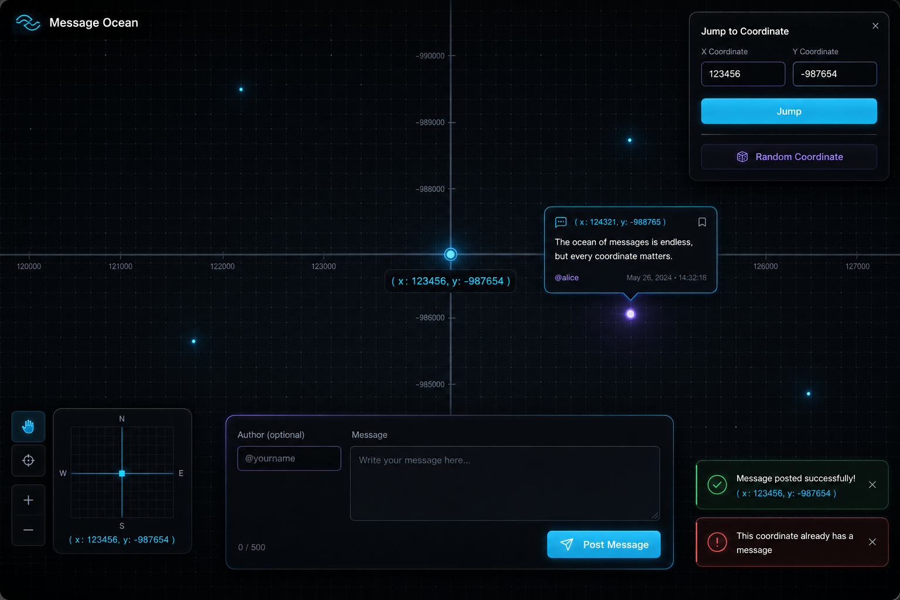

# Message Starfield

*Plot twist: it is not an ocean. It is a **message starfield**—and every post is a star.*

**Plant a thought in the dark. Drift until you collide with someone else's light years later. No telescope required—only coordinates and curiosity.**

Message Ocean is an infinite, draggable map of the night sky (disguised as a grid). Pick `(x, y)`, leave a message, and that coordinate becomes a **star**—a tiny point of light waiting for the next wanderer. Pan across the void, follow the glow, and see what strangers pinned to the firmament. One message per coordinate. The universe is huge; your take is a single pixel in the cosmos.

**Live app:** [https://messages-ocean.vercel.app/](https://messages-ocean.vercel.app/)

---

## What you can do

- **Light a star** — Claim coordinates, write a message, optionally sign it. One star per cell. No duplicates, no constellations of spam.
- **Stargaze** — Drag through the dark grid. Every glowing dot is someone who was here before you.
- **Warp** — Jump to exact coordinates or hit **Random Coordinate** and let fate pick your next patch of sky.
- **Browse locally** — We fetch a wide patch of sky at once and cache it, so your journey does not spam the server every time you nudge one grid square.

---

## Philosophical disclaimer

The starfield does not fact-check. It does not moderate. It only remembers where each light was lit. Look up responsibly.
